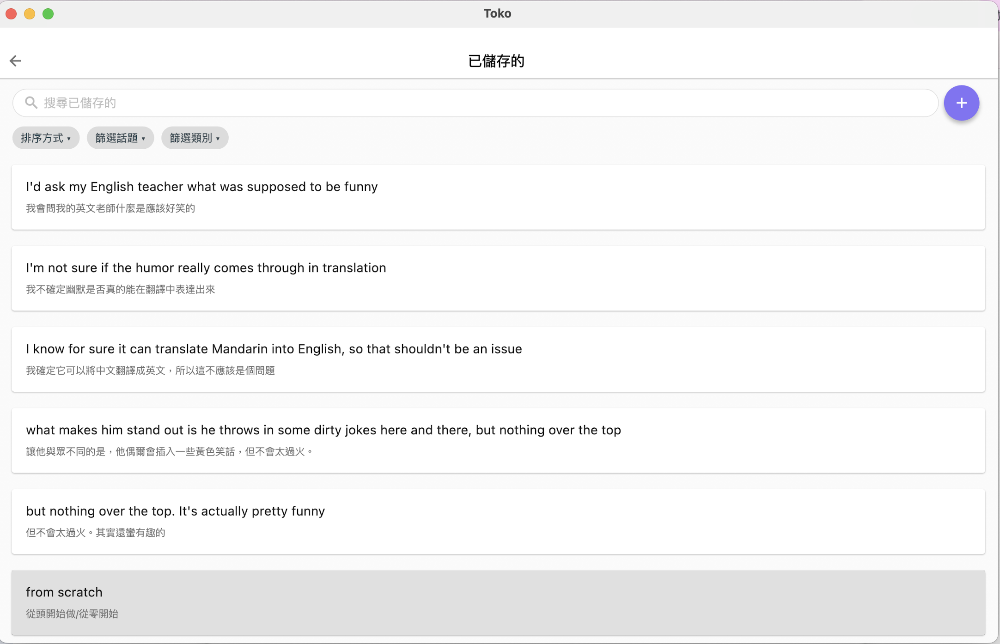

# Toko-to-Anki (MacOS)

### 自動化的目的
本人因為想精進自身英文口說，購買了Toko這款AI口說練習軟體，其中Toko中設有可以將與AI對話練習的內容儲存收集的功能，但內建的複習方式與儲存單字的檢視較為簡單。所以想透過Anki的單字卡功能提升複習的成效，並研究開發出了這個自動化的小工具，可以快速將Toko儲存區的單字批量轉乘CSV檔並匯入Anki。

### 如何自動化：轉換5步驟
- **Step1：準備工作**
  - 把螢幕錄影先確定好只選擇Toko的畫面。
  - 先打開Toko的儲存頁面，按 Shift + Tab 鍵（按10下），把灰色的選擇鍵選到畫面最下面的單字。

  
- **Step2：螢幕錄影收集儲存單字**
  - 打開scripts資料夾中的step1_auto_scroll.py的文件，執行文件，等待文件執行間把螢幕錄影打開，開始執行。
  - 在想要暫停時按 control + C ，暫停執行（建議約100個就可以暫停了），並結束螢幕錄影。
  - 將錄影的檔案名稱改為 toko_video.mp4。
  
- **Step3：將錄影自動截圖並OCR解析**
  - 打開scripts資料夾中的step2_screenshot.py的文件，執行文件。將不同的畫面截圖並放入資料夾後辨識。
  
- **Step4：資料清洗並調整格式後匯出CSV**
  - 打開scripts資料夾中的step3_csv.py的文件，執行文件。
  - 該文件會將收集到的單字轉換為第1欄為中文翻譯，第2欄為英文，第三欄為口語的標籤，這是我慣用的單字卡格式，可以自行對其調整。
  - 可以注意一下最後一截圖的單字為何且，總共轉換的單字數量為何，在下一步可以先預估需要自動刪除的次數。
  
- **Step5：刪除Toko已轉換內容**
  - 打開Toko儲存頁面，準備將滑鼠放在第一個被截圖的單字中間
  - 打開scripts資料夾中的step4_delete.py的文件，可以透過轉換的單字數量來把文件中 repeat_times = 30 改為接近轉換的數字（轉換了80個單字，可以把repeat_times改成70，後面自己稍微確認一下最後刪除的單字）執行文件。
 
### 接下來就可以開心地背單子了，祝學習愉快！
